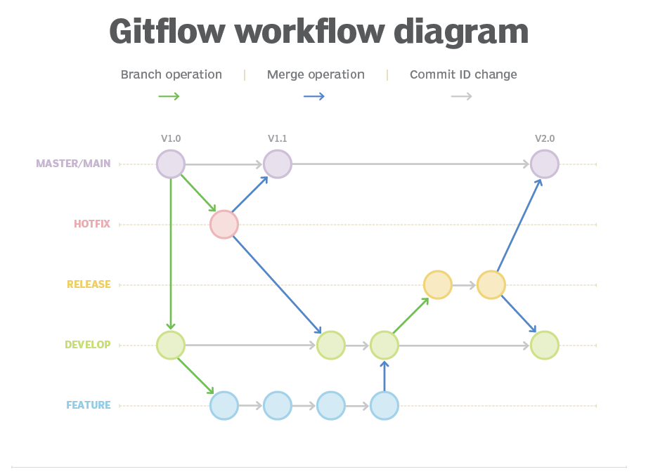

## To-Do App
A [Laravel 11](https://laravel.com/docs/11.x) based **To-Do** list project with task completion tracking analytics.

## Installation
### Clone Repository
Clone the repo either via git command(ssh or https) or download directly and navigate to project root folder.
```sh
git clone <repository_url>
cd todo-app
```

### Pre-requisite(s)
Major ones are
- PHP - 8.2 or Higher
- Sqlite PDO extension for php

You can view a detailed list of platform requirements using the command below and ensure they are fulfilled.
```sh 
composer check-platform-reqs
```

### Project Setup
```sh
# Make .env file & adjust env variables as per need
cp .env.example .env 

# Install composer dependencies
composer install

# Generate application encryption key
php artisan key:generate

# Generate Migration & Run seeders
touch database/database.sqlite
php artisan migrate
php artisan db:seed

# To serve the APIs
php artisan serve
```

## Deployment & Release
### Git branch naming convention & release workflow
| Type        | Name                    | Example           | Clone From | Merge To             |
|-------------|-------------------------|-------------------|------------|----------------------|
| Production  | main                    | -                 | -          | -                    |
| Development | dev                     | -                 | main       | -                    |
| Feature     | feature/<feature-title> | feature/analytics | dev        | dev                  |
| Release     | release/<version>       | release/1.0       | dev        | main, dev(for fixes) |
| Hotfix      | hotfix/<hotfix-title>   | hotfix/fix-todo   | main       | main & dev           |



For laravel deployment to server, follow [Deployment](https://laravel.com/docs/11.x/deployment).

### Pre-commit checks
```shell
# For code standards and style issue fixing
./vendor/bin/pint
# To run tests
php artisan test
```

For more information
- [Laravel Pint](https://laravel.com/docs/11.x/pint)
- [Testing](https://laravel.com/docs/11.x/testing)

## Developers
- **[Jitendra Yadav](mailto:jeetu.yadav28@gmail.com)**

## Security Vulnerabilities
NA
